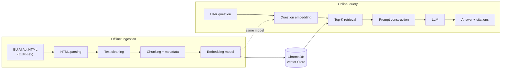

# Articulate

**Articulate is a Retrieval-Augmented Generation (RAG) assistant that helps ML and data professionals navigate the EU AI Act.** It retrieves relevant passages from the regulation and generates concise, source-grounded answers with citations.

The project focuses on reliable retrieval, traceable answers, and explicit handling of questions that cannot be answered from the available corpus.

> **Work in progress:** built over 14 days as an end-to-end RAG engineering project.

---

## The Problem

The **EU AI Act** (Regulation (EU) 2024/1689) is a large and complex regulatory text, with more than 140 pages, 180 recitals, 113 articles, and 13 annexes. Articles frequently reference other provisions and annexes, making it time-consuming to locate the relevant information, even for professionals working with AI systems.

Articulate is designed primarily for **data scientists and machine learning engineers** who need to understand whether an AI system may fall within the scope of the regulation and identify the relevant requirements.

Articulate is **not a legal advisor** and does not provide legal opinions. Its purpose is to help users find and understand the relevant provisions of the regulation while clearly showing the source used to generate each answer.

---

## Example Questions

The following questions form the initial evaluation set for Articulate. They are intentionally designed to test different capabilities of the RAG system.

| # | Question | Type | Expected source(s) |
| - | -------- | ---- | ------------------ |
| 1 | What does the EU AI Act mean by an "AI system"? | Factual / single passage | Article 3(1), Recital 12 |
| 2 | Which AI systems are classified as high-risk because they are safety components of products covered by the legislation listed in Annex I, and what conditions must they meet? | Multi-passage / cross-reference | Article 6(1), Annex I |
| 3 | I am developing a tool that automatically screens CVs and ranks candidates for recruitment. Could my system be subject to the EU AI Act? | Practical / user-oriented | Article 6(2) and 6(3), Annex III point 4 |
| 4 | When do the main provisions of the EU AI Act start to apply? | Date / timeline | Article 113 |
| 5 | What fines does the United Kingdom impose on companies deploying non-compliant AI systems? | Out of corpus / abstention | Not in corpus |

The fifth question is deliberately close to the topic of the regulation but outside its scope: the EU AI Act defines penalties for the EU, not for the United Kingdom. A correct answer must explicitly state that the information is not available in the corpus, rather than answering from external knowledge or presenting EU penalties as if they applied.

Two evaluation principles follow from this set:

* **Source granularity:** expected sources are defined at the paragraph or point level where possible, which will guide chunking and retrieval metrics.
* **Multiple valid sources:** a question can be correctly supported by more than one passage (for example, a definition in an article and its explanation in a recital). The evaluation dataset will therefore accept a set of valid sources rather than a single one.

These questions will later be extended into the project's evaluation dataset, with `expected_answer` and `expected_sources` fields.

---

## What Makes a Good Answer?

A good Articulate answer should satisfy four criteria:

* **Faithfulness:** the answer accurately reflects the retrieved provisions without inventing information.
* **Traceability:** the answer identifies the article, paragraph, or annex used as its source.
* **Conciseness:** the answer addresses the question directly, without unnecessary legal interpretation.
* **Abstention:** when the answer is not supported by the corpus, the assistant explicitly says so rather than hallucinating.

These principles will later be translated into quantitative and qualitative evaluation metrics.

---

## Architecture



The ingestion and query pipelines are deliberately separated because they have different **lifecycles and responsibilities**.

The offline pipeline processes the source document and builds the searchable knowledge base. It runs only when the corpus or the ingestion settings change, outside the user-facing request path.

The online pipeline answers individual questions. It retrieves relevant chunks from the existing vector store and passes them to the LLM as context, together with their metadata so that each answer can cite its sources.

**ChromaDB is the boundary between these two workflows:** the offline pipeline writes embeddings and metadata, while the online pipeline reads them during retrieval. Both pipelines must use **the same embedding model**, otherwise question and chunk vectors would not live in the same space and similarity scores would be meaningless.

This separation also makes the system easier to test, to debug (a wrong answer can be traced to either retrieval or generation), and to evolve, since each component can be replaced independently.

---

## Design Decisions

| Decision | Choice | Rationale |
| -------- | ------ | --------- |
| **Corpus language** | English | Keeps the repository, evaluation questions, prompts, and documentation consistent, with access to a broad range of embedding models. |
| **Package manager** | `uv` | A single tool manages both the Python version and dependencies, and the committed `uv.lock` guarantees an identical environment locally, in CI, and in Docker. |
| **Project structure** | `src/` layout | Tests run against the installed package rather than files in the working directory, so packaging errors are caught early. |
| **Source document** | EUR-Lex HTML, downloaded by script. Chosen over the PDF after comparing samples: the HTML preserves the legal structure (recitals, articles, annexes) and avoids page artifacts such as headers, footers and footnotes interleaved with the text. |
| **Vector database** | ChromaDB | Lightweight, local-first vector store, well suited to a prototype while keeping the retrieval architecture explicit. |
| **Embedding model** | To be decided (Day 4) | Will be selected empirically based on retrieval metrics. |
| **LLM** | To be decided (Day 6) | Will be selected based on answer quality, cost, latency, and the open-source/free constraint of the project. |
| **CI/CD** | GitHub Actions | Free CI/CD integrated with the repository, without cloud infrastructure costs. |
| **Container registry** | GHCR | Integrates natively with GitHub Actions for publishing Docker images. |
| **Architecture** | Offline ingestion + online query | Separates document processing from user requests, making the system easier to evaluate and evolve. |

These decisions will evolve as the project develops. Each major change will be documented together with its rationale.

---

## Known Limitations

* **Not legal advice:** Articulate helps locate and explain provisions, but its answers do not replace a legal opinion.
* **Static corpus:** the corpus is the text of Regulation (EU) 2024/1689 as published in 2024. Later amendments or changes to the application timeline are not reflected, so an answer can be faithful to the corpus while being outdated in practice.

---

## Installation

Clone the repository and install the project dependencies:

```bash
git clone https://github.com/MrBroma/ai-act-assistant.git
cd ai-act-assistant
uv sync
```

Run the test suite:

```bash
uv run pytest
```

Further instructions will be added as the ingestion pipeline, API, and Docker environment are implemented.

---

## Project Status

Articulate is being developed as a **14-day end-to-end RAG engineering project**, covering ingestion, chunking, embeddings, retrieval, prompt engineering, evaluation, API, containerization, CI/CD, experiment tracking, and monitoring.

The objective is not only to build a working chatbot, but to understand and demonstrate the engineering decisions required to build, evaluate, and maintain a reliable RAG application.